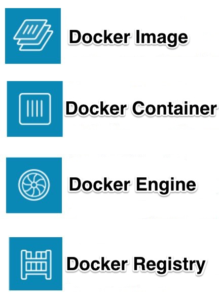

## Docker Introduction

- What is Docker?
- Why Docker?
- What is a container?

---

### What is docker?

---

---

### Why Docker?

---

### Containers as solution

- Packages up software binaries and dependencies
- Isolates software from each other 
- Container is a standard format
- Easily portable across environment
- Allows ecosystem to develop around its standard

---

### Why should developers care?

- A fast, clean, safe, hygienic and portable runtime
- No missing dependencies, packages and other pain points
- Own isolated container, various versions of libraries
- Automate testing, integration, packaging
- Reduce/eliminate concerns about compatibility on platforms
- Cheap, zero-penalty containers to deploy services?

---

### Why should Ops care?

- Make the entire lifecycle more efficient, consistent and repeatable
- Increase the quality of code produced by devs
- Eliminate inconsistencies between dev, test, prod and customer environments
- Support segregation of duties
- Significantly improves the speed and reliability of CI/CD
- Lightweight, address significant performance, deployment costs

---

### What is a container?

---

[__04 Docker Commands__](http://localhost:1948/04_docker_commands.md#/)
